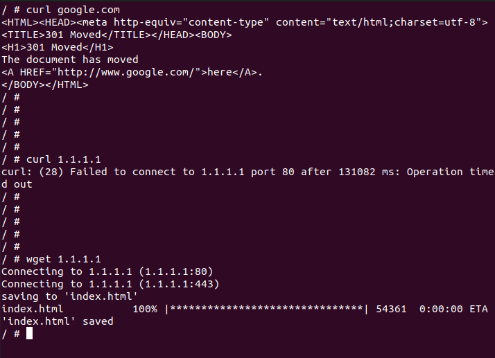

# Contain
BPF based per-process per-container egress filter.

Filters outgoing traffic from containers based on the container and the process the traffic originated from. Once containd is running, it automatically detects any new containers.

## Run

**Requires cgroup v2**

1. Update `blacklist.json` with your own allow list.

2. To start Contain daemon, run
```
python3 containd.py
```

When the daemon is running, it detects any newly started containers and applies policies to them.

Once started, the allow list

```json
[
	{	
		"container_name": "curler", // Only add a single object per container
		"policy": [
			{
				"process": "curl", // Only add a single object per process, add one/multiple objects per container
				"allow": [
					{
						"cidr4": "1.1.1.0/24",
						"ports": [80, 443]
					}
				]
			}
		]
	}
]

```

Gives



This BPF filter uses `BPF_PROG_TYPE_CGROUP_SKB` and a kretprobe to kernel function `net/socket/sock_alloc_file` for per-process, per-container socket filtering.

Tested on Linux 5.19.0 - 6.2.0
